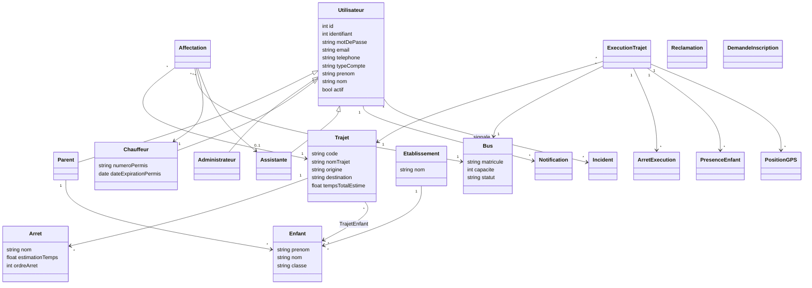

# Modèle métier en français

Le serveur utilise SQLite. Le modèle reprend les entités du schéma métier
fourni et conserve les extensions nécessaires au suivi GPS, aux affectations
historiques et aux demandes d'inscription.

## Correspondance fonctionnelle

| Fonction | Tables principales |
|---|---|
| Comptes et authentification | `Utilisateur`, `Parent`, `Administrateur`, `Chauffeur`, `Assistante` |
| Enfants et établissements | `Enfant`, `Etablissement` |
| Bus, trajets et arrêts | `Bus`, `Trajet`, `Arret` |
| Affectations | `Affectation`, `TrajetEnfant` |
| Exécution et présence | `ExecutionTrajet`, `ArretExecution`, `PresenceEnfant` |
| Localisation | `PositionGPS` |
| Communication | `Notification`, `Incident`, `Reclamation` |
| Inscriptions | `DemandeInscription` |

Les clés étrangères sont activées, les statuts sont limités par des contraintes
`CHECK`, et une seule affectation active est autorisée par trajet.
